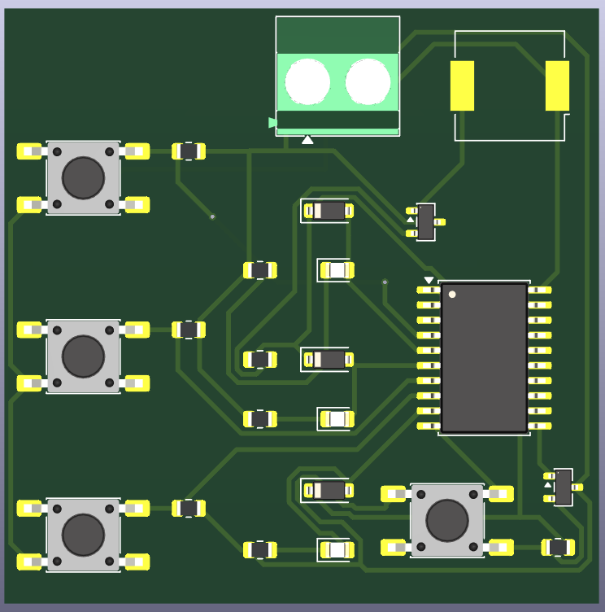
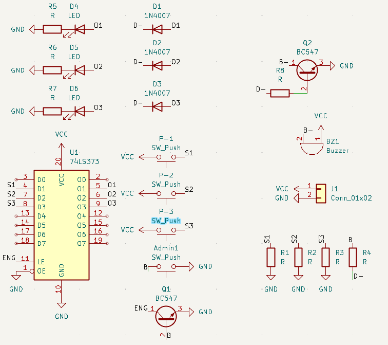
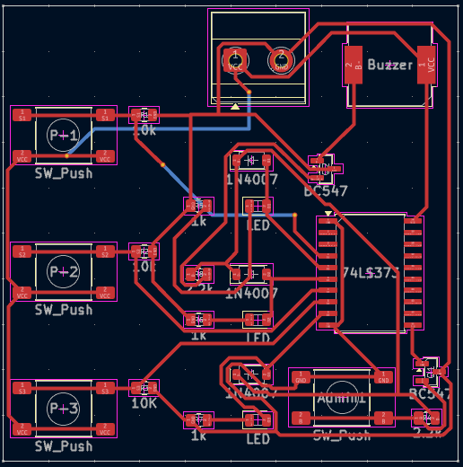
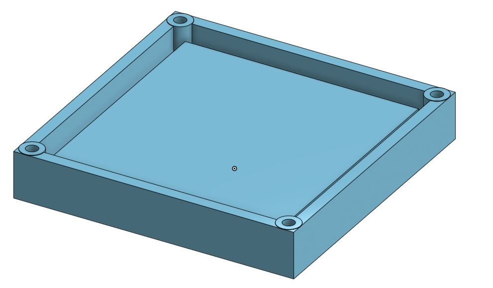
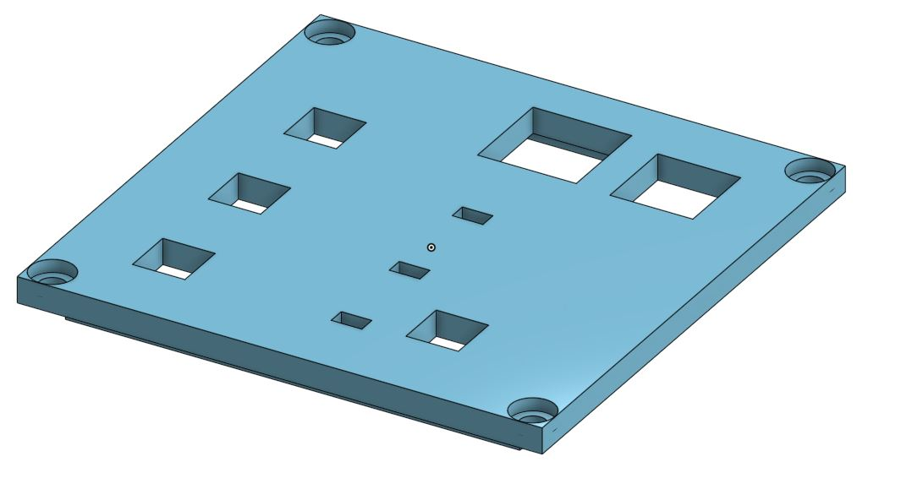
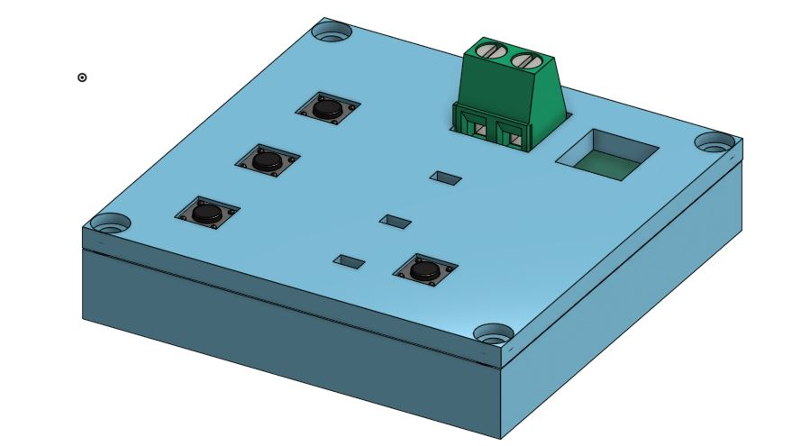

# Buzzer Game

This is a buzzer game setup like we see in TV shows, in which the player that presses the button first, his buzzer beeps and all other players are locked out until the admin allows.

## Working

The 74HC373 IC has an octal D-Latch that controls the first to press logic. The LE pin is controlled by a feedback loop. When a player presses his button the IC captures that state by pulling the LE pin low and freezes the mechanism and when the admin button is pressed it resets the latch.

## PCB

I made a PCB for this project, I tried to keep it single sided but there are two tracks that are on the bottom layer.

|Schematics|Tracks|
| :---: | :---: |
|  |  |

## 3D Casing

I also designed a 3D enclosure box for the Project.

|Box|Lid|
| :---: | :---: |
|  |  |

## Bill of Materials (BOM)

| Name | Quantity | Total Cost (USD) | Link | Distributor |
| :---: | :---: | :---: | :---: | :---: |
| Solder Mask | 1 | 1.65 | [Solder Mask](https://epro.pk/product/10cc-uv-solder-mask-ink-flux-welding-mechanic-in-pakistan/) | EPro |
| Ferric Chloride | 2 | 1.00 | [Ferric Chloride](https://epro.pk/product/ferric-chloride-powder-for-pcb-etchant-fecl-in-pakistan/) | EPro |
| Rivets | 1 | 9.00 | - | AliExpress |
| Transparency Sheets | 1 | 8.00 | [Transparency Sheets](https://stationers.pk/products/transparency-sheets?_pos=1&_sid=1455f1e48&_ss=r) | Stationers |
| Copper Clad Board | 1 | 7.00 | [Copper Clad Board](https://epro.pk/product/double-sided-pcb-12x12-in-pakistan/) | EPro |
| Reflow Gun | 1 | 15.00 | [Reflow Gun](https://digilog.pk/products/kada-835d-hot-air-gun-smd-rework-station-thermo-control-anti-static-portable-smd-rework-station) | DigiLog |
| Resistors | 11 | 4.86 | [Resistors](https://www.aliexpress.com/item/1005004145810949.html?spm=a2g0o.cart.0.0.1a3438dapWXx8H&mp=1&pdp_npi=6%40dis%21USD%21USD+1.62%21USD+1.61%21%21USD+1.61%21%21%21%402141122217765785921945522e1a32%2112000028184503888%21ct%21PK%212961473668%21%211%210%21) | AliExpress |
| Buzzer | 3 | 4.36 | [Buzzer](https://www.aliexpress.com/item/4000043951008.html?spm=a2g0o.cart.0.0.1a3438daAFLFTm&mp=1&pdp_npi=6%40dis%21USD%21USD+2.18%21USD+2.18%21%21USD+2.18%21%21%21%402140c1e917765782907343521ed3bd%2110000000099604494%21ct%21PK%212961473668%21%211%210%21&pdp_ext_f=%7B%22cart2PdpParams%22%3A%7B%22pdpBusinessMode%22%3A%22retail%22%7D%7D) | AliExpress |
| LEDs | 3 | 7.00 | [LEDs](https://www.aliexpress.com/item/1005009128722843.html?spm=a2g0o.cart.0.0.1a3438daAFLFTm&mp=1&pdp_npi=6%40dis%21USD%21USD+2.21%21USD+2.21%21%21USD+2.21%21%21%21%402140c1e917765782907343521ed3bd%2112000048016234041%21ct%21PK%212961473668%21%211%210%21) | AliExpress |
| Button | 4 | 1.59 | [Button](https://www.aliexpress.com/item/1005001304127863.html?spm=a2g0o.cart.0.0.1a3438daAFLFTm&mp=1&pdp_npi=6%40dis%21USD%21USD+1.70%21USD+1.68%21%21USD+1.68%21%21%21%402140c1e917765782907343521ed3bd%2112000015639874024%21ct%21PK%212961473668%21%211%210%21) | AliExpress |
| 1N4007 Diode | 3 | 2.38 | [Diode](https://www.aliexpress.com/item/32751841595.html?spm=a2g0o.cart.0.0.1a3438daAFLFTm&mp=1&pdp_npi=6%40dis%21USD%21USD+2.32%21USD+2.32%21%21USD+2.20%21%21%21%402140c1e917765782907343521ed3bd%2112000016561662489%21ct%21PK%212961473668%21%211%210%21) | AliExpress |
| BC847 Transistor | 2 | 2.32 | [Transistor](https://www.aliexpress.com/item/1005008829335370.html?spm=a2g0o.cart.0.0.1a3438daAFLFTm&mp=1&pdp_npi=6%40dis%21USD%21USD+2.44%21USD+2.37%21%21USD+2.37%21%21%21%402140c1e917765782498232725ed3bd%2112000046856587364%21ct%21PK%212961473668%21%211%210%21) | AliExpress |
| 74HC373 IC | 1 | 4.11 | [74HC373 IC](https://www.aliexpress.com/item/33052702425.html?spm=a2g0o.cart.0.0.1a3438daAFLFTm&mp=1&pdp_npi=6%40dis%21USD%21USD+4.11%21USD+4.11%21%21USD+4.03%21%21%21%402140c1e917765782778963273ed3bd%2167402727853%21ct%21PK%212961473668%21%211%210%21&pdp_ext_f=%7B%22cart2PdpParams%22%3A%7B%22pdpBusinessMode%22%3A%22retail%22%7D%7D) | AliExpress |